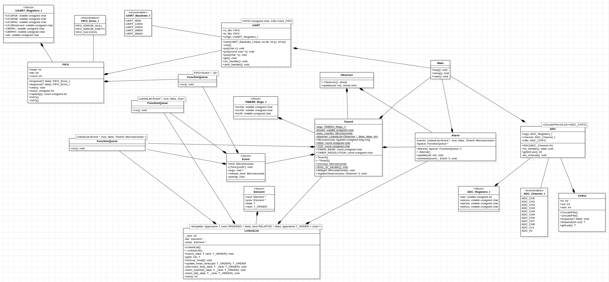

# IFSC STE 2022.2 - Biblioteca para o ATMega328P

Esta é uma biblioteca para uso de componentes do <a href="https://ww1.microchip.com/downloads/en/DeviceDoc/Atmel-7810-Automotive-Microcontrollers-ATmega328P_Datasheet.pdf">ATmega328P</a> (MCU presente no Arduino Uno) utilizando o GCC. O objetivo deste projeto é estudar e conhecer a MCU AVR em uso e, neste processo, aplicar conceitos de projeto de sistemas embarcados. A linguagem-base da biblioteca é C++, embora alguns trechos de código podem conter sequências C ou em assembly.

# Atividade 3 - Fila de funções e escalonamento

Esta atividade tem o intuito de realizar a implementação de duas lições sobre o RMS (Rate Monotonic Scheduling) e EDD (Earliest Due Date) de análise dos escalonadores conforme as sequências de execução nos slides 14 e 15, para o RMS, e exemplos 1 e 2 do slide 17, para o EDD.


Para o primeiro exemplo implementado em RMS é mostrado uma escala que funciona, pois prioridade ocorre com sucesso no seu tempo de agendamento previsto.Já o segundo exemplo é mostrado uma escala que não funciona, pois a primeira tarefa possui um tempo de execução uma pequena taxa de erro, que leva a segunda tarefa a ter um delay no inicio de sua execução.

</img>

</img>

Para o primeiro exemplo implementado em EDD é mostrado um agendamento que funciona, pois tempo de execução das tarefas é menor que sua deadline. Já o segundo exemplo é mostrado um agendamento que não funciona, pois o tempo agendado para a terceira tarefa acaba não podendo ser atingido graças ao tempo de execeção das outras tarefas.

</img>

## Diagrama UML 

</img>

# FIFO

A estrutura de dado FIFO("first in first out") foi implementada para ser usada dentro do componente da UART,pois como o funcionamento da UART é de forma serial com o terminal é necessário esta estrtura de dado para adequar-se ao comportamento dos requisitos do projeto.
## Atributos
```cpp
T buffer[N]: Formato da fila é um buffer de tamanho N;
int head, tail, count: Head é o começo da fila, tail representa o final da mesma e count o número de dados que existem na fila.
```

## Métodos 
```cpp
FIFO_Erros_t enqueue(T data): Responsável por enfileirar um dado recebido por parâmetro na fila e retorna um ENUM que representa uma mensagem.
FIFO_Erros_t dequeue(T *data): Responsável por desinfeileirar um dado dentro da fila e passa-lo para o dado de parâmetro.
```
# UART

A UART implementada tem o propósito neste projeto de receber bytes de dados do componente ADC e transmitir os bits individuais de forma seqüencial para informar o valor medido no terminal. Basicamente o funcionamento deste componente foi possível por meio de interrupções proporcionado pela técnica de polling onde o dispositivo verifica constantemente se é necessário realizar a ação específicada pelo software.
## Atributos

```cpp
static USART_Registers_t *uregs: Esta váriavel é responsável por armazenar os valores referentes aos registradores da USAR.
static Uart_FIFO tx_fifo: A fila de transmissão que contém os dados recebidos da transmissão.
static Uart_FIFO rx_fifo: A fila de recepção que contém os dados armazenados pelo hardware.
```

## Métodos 
```cpp
Uart(Uart::UART_Baudrate_t baud, int db = 8, int pr = 0, int sb = 1): Construtor de uma Uart que é necessário informar o Baundrate, data bits, parity e stop bit referente ao terminal usado.
void put(char c): Enfileiramento da transmissão.
char get(): Captura dado da fila de recepção.
static void rxc_handler(): Retira dado colocado no harware e coloca na fila.
static void udre_handler(): Desinfeileira a transmissão recebida e coloca no hardware.
```


# Event

Event possui os atributos necessárias para o funcionamento do escalonamento na fila de funções caso em prioridade de uma tarefa utilizada no RMS, para determinar a ordem das funções a serem executadas.

## Atributos
```cpp
struct Event
    {
        Microseconds time; 
        Microseconds release_time = Timer0::micros();
        void (*func)(void*);
        void * args;
        char priority; 
    };
```
# Function Queue

A Fila de funções foi implamentada para ser utilizada como componente do Alarme, onde é gurdada a ordem da funções agendadas no sistema. Esta podendo ser uma `FIFO` ou uma `LinkedList`.

## Métodos

```cpp
    #if SCHED_TYPE == SCHED_FIFO
    class FunctionQueue : public FIFO<Event *, 16>
    void run()

    #if SCHED_TYPE == SCHED_RMS
    class FunctionQueue : public LinkedList<Event *, true, false, char>
    void run()

    #if SCHED_TYPE == SCHED_EDD
    class FunctionQueue : public LinkedList<Event *, true, false, Microseconds>
    void run()
```

# Alarme

O Alarme implementado tem como objetivo agendar e atulizar a funções a serem executadas em um sistema por meio de uso da estruturas de duas estruturas de dados uma LinkedList e fqueue.

## Atributos

```cpp
    LinkedList<Event *, true, true, Timer0::Microseconds> events;

    FunctionQueue * fqueue;
```

## Métodos

```cpp
    void update(int val)

    void schedule(Event * event_)
```

# Timer0

Nesta classe é implementado o Timer0 como visto no datasheet ATmega328P, que tem como função contar o tempo em microsegundos e gerar delays no sistema.

## Atributos

```cpp
    struct Timer0_Regs_t
    {
        volatile unsigned char tccr0a;
        volatile unsigned char tccr0b;
        volatile unsigned char tcnt0;
    };
    static volatile unsigned char * regs_timsk0;
    static Timer0_Regs_t * regs;
    static Microseconds usec_counter;

    static LinkedList<Observer*,false,false> observers;
```

## Métodos

```cpp
    static Microseconds micros()

    static void timer0_isr_handler()

    void delay(Microseconds d)

    void registerObserver(Observer * obs)
```

# LinkedList

Implementação da estrutura de dados: lista encadeada que pode ser ordenada e/ou relativa para um determinado tipo de dado.

## Atributos

```cpp
    struct Element
    {
        Element *next, *prev;
        T data;
        T_ORDER rank;
    };

    Element *head, *tail;

    int _size;
```

## Métodos

```cpp
    void insert(T _data, T_ORDER _rank = 0)

    T get(int i)

    T remove_head()

    T_ORDER update_head_rank(T_ORDER upd)

    int size()

    void insert_ordered(T _data, T_ORDER _rank)

    void insert_tail(T _data, T_ORDER _rank)
```
<h1 align='center'>Autores</h1>

<a href="https://github.com/jeffersonbcr">
    <br/>
    <sub><b>Jefferson Botitano</b></sub></a>

<br><br/>

<a href="https://github.com/arliones">
    <br/>
    <sub><b>Arliones Hoeller Jr</b></sub></a>